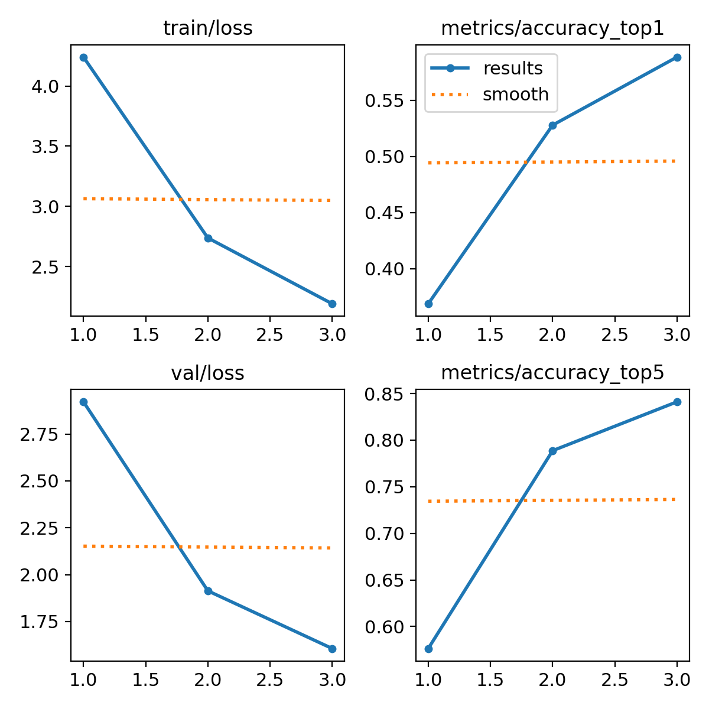
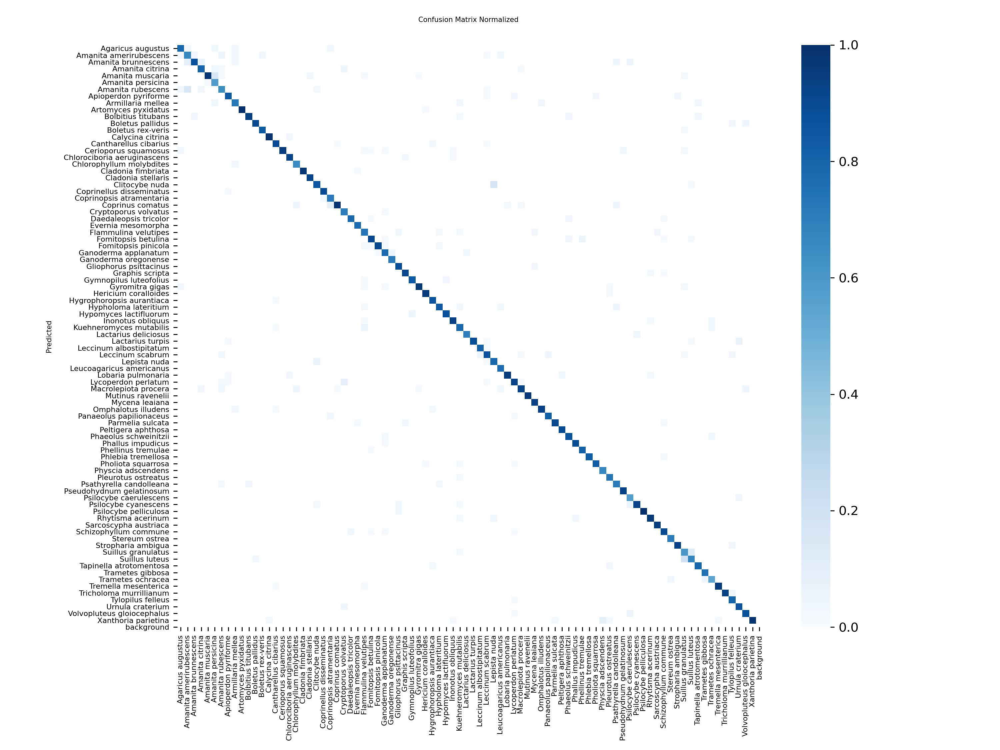
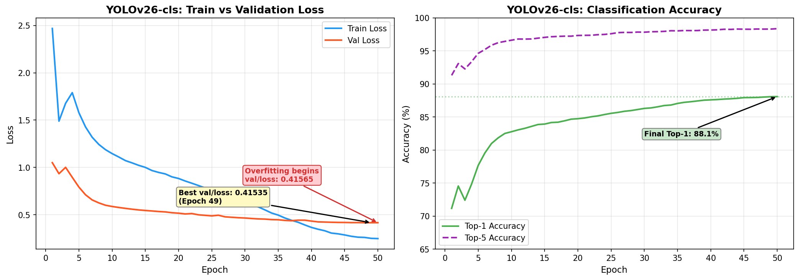
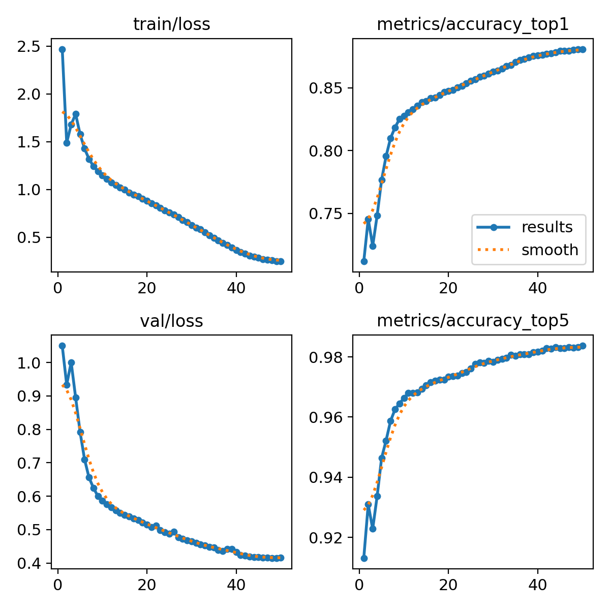
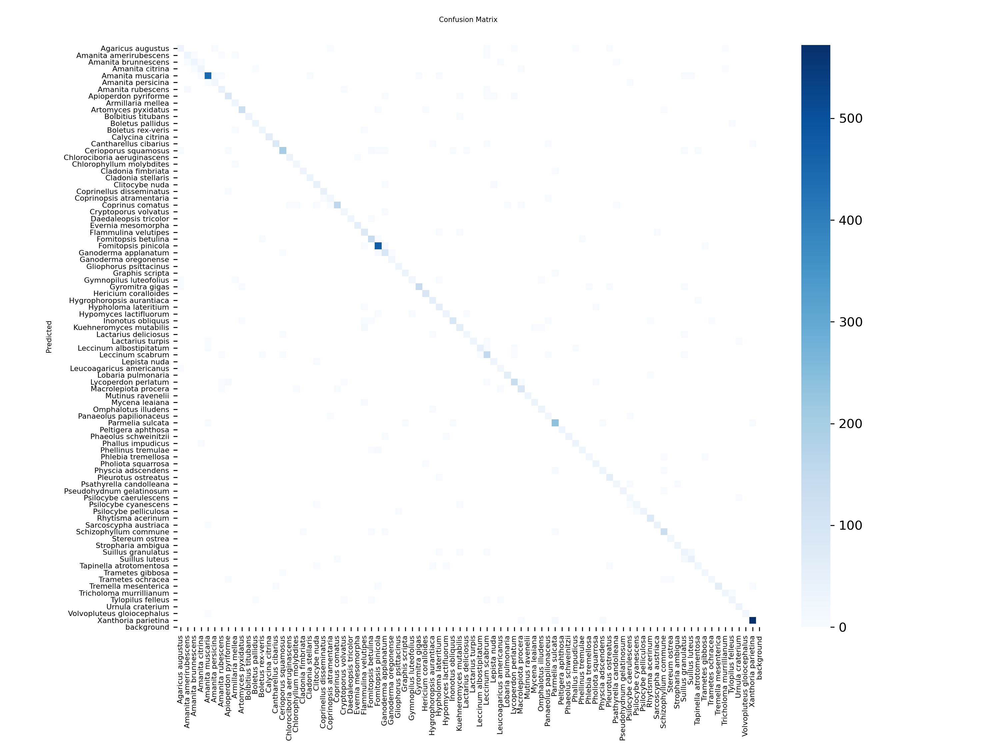

# 🍄 Mushroom Classifier: Model Comparison Log

This document tracks and compares the training metrics, performance, and hardware requirements between different YOLO classification models.

When you train a new model, fill in the **[TBD]** fields below to compare it against the baseline YOLOv8n model.

## 📊 High-Level Overview

| Metric                     | YOLOv8n-cls (Baseline) | YOLOv26-cls (New)      | Winner  |
| :------------------------- | :--------------------- | :--------------------- | :------ |
| **Model Size (MB)**        | ~6.2 MB                | 3.6 MB                 | YOLOv26 |
| **Parameters**             | ~2.7 Million           | 1.74 Million           | YOLOv26 |
| **Training Time**          | [TBD] mins             | ~159 mins (2.65 hours) | [TBD]   |
| **Epochs to Converge**     | 50 epochs              | 49 epochs              | [TBD]   |
| **Final Accuracy (Top-1)** | [TBD]%                 | 88.1%                  | [TBD]   |
| **Final Loss (val/loss)**  | [TBD]                  | 0.415                  | [TBD]   |
| **Inference Speed**        | [TBD] ms / img         | 0.2 ms / img           | [TBD]   |

---

## 📈 Detailed Breakdown

### 1. YOLOv8n-cls (Baseline)

The smallest and fastest model from the YOLOv8 generation. Excellent for real-time inference on weak hardware (like mobile phones) but may struggle with highly similar mushroom species.

- **Optimizer Used:** `Auto (AdamW)`
- **Loss Function:** `Cross-Entropy Loss (BCE)`
- **Starting Learning Rate (`lr0`):** `0.01` (Default)
- **Training Hardware:** `[Insert: CPU / RTX 3060 / etc.]`
- **Notable Observations:**
  - _e.g., "Learned very quickly initially but plateaued around epoch 15."_

#### Training Results



#### Confusion Matrix


#### Normalized Confusion Matrix



### 2. YOLOv26-cls (New Architecture)

_Note: Make sure to document any changes to hyper-parameters (like learning rate or epochs) below!_

- **Optimizer Used:** `Auto (AdamW)`
- **Loss Function:** `Cross-Entropy Loss (BCE)`
- **Starting Learning Rate (`lr0`):** `0.01`
- **Training Hardware:** `NVIDIA GeForce RTX 3070 Ti (8GB)`
- **Notable Observations:**
  - _Training loss decreased steadily alongside validation loss until the very final epoch (Epoch 50), where validation loss ticked up slightly (0.41535 → 0.41565), indicating a perfect, well-timed stop right before overfitting began._
  - _Epoch 49 achieved the lowest validation loss (0.41535). Epoch 50 is the inflection point — the moment the model began memorizing training data instead of generalizing._

#### Training Analysis



| Key Observation          | Detail                                             |
| :----------------------- | :------------------------------------------------- |
| **Best Epoch**           | 49 (val/loss = 0.41535)                            |
| **Overfit Epoch**        | 50 (val/loss = 0.41565, Δ +0.0003)                 |
| **Final Top-1 Accuracy** | 88.1%                                              |
| **Final Top-5 Accuracy** | 98.4%                                              |
| **Train Loss (final)**   | 0.247                                              |
| **Convergence Pattern**  | Smooth, consistent decline — no plateaus or spikes |

#### Training Results



#### Confusion Matrix



#### Normalized Confusion Matrix


---

## 🔍 Side-by-Side Visual Comparison

### Training Results

|                          YOLOv8n-cls                           |                          YOLOv26-cls                          |
| :------------------------------------------------------------: | :-----------------------------------------------------------: |
|  |  |

### Confusion Matrices (Normalized)

|                                     YOLOv8n-cls                                      |                                     YOLOv26-cls                                     |
| :----------------------------------------------------------------------------------: | :---------------------------------------------------------------------------------: |
|  |  |

### Training Analysis

|              YOLOv8n-cls               |                                    YOLOv26-cls                                    |
| :------------------------------------: | :-------------------------------------------------------------------------------: |
| _(no training_analysis.png generated)_ |  |

---

## 💡 How to update the training script for the new model

To swap you training script over to the new model, just open `scripts/training/train_yolo.py` and change line 25:

```python
# OLD
model = YOLO('yolov8n-cls.pt')

# NEW
model = YOLO('yolov26-cls.pt')  # Or whatever the exact .pt filename is!
```
